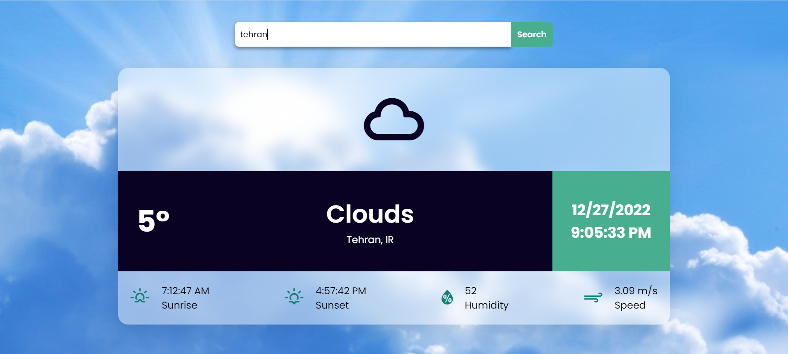
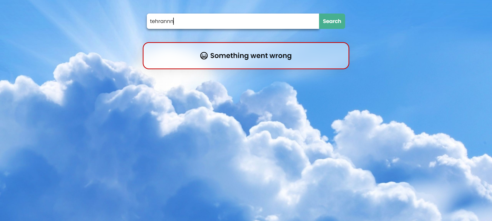
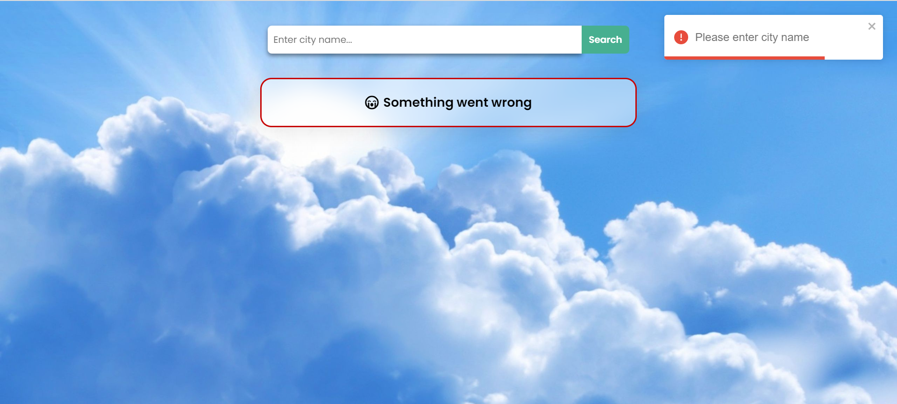
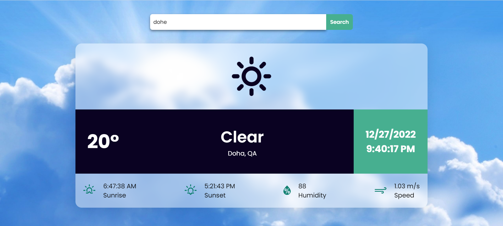

# Weather_App

This project is a weather app. In this app, user can search a city name and see the information about weather, sunrise and sunset time,humidity and wind speed. The app uses OpenWeather API to get the information. Demo on [Vercel](https://weather-app-chi-self.vercel.app/).

## Technologies

- HTML5
- CSS3
- React.js
- OpenWeather API

## Screenshots

## Getting Started with Create React App

This project was bootstrapped with [Create React App](https://github.com/facebook/create-react-app).

## Available Scripts

In the project directory, you can run:

### `npm install`

Installs the packages needed in this project.

### `npm start`

Runs the app in the development mode.\
Open [http://localhost:3000](http://localhost:3000) to view it in your browser.

The page will reload when you make changes.\
You may also see any lint errors in the console.

You should make '.env' file in the root directory according to the '.env-sample' file and put your API_KEY that you get from OpenWeather website inside it.

